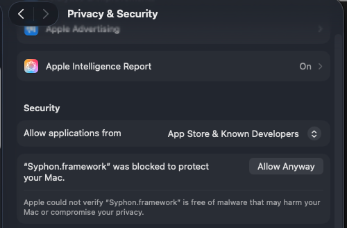
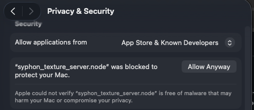

# Cables Standalone macOS (Apple Silicon) Operators

A high-performance collection of native **macOS Apple Silicon (`arm64`)** extension operators for [Cables Standalone](https://cables.gl/standalone). 

This library bridges Cables.gl with native macOS system APIs, hardware controllers, Apple Neural Engine (ANE), Metal graphics, and inter-application video streaming frameworks—unlocking low-latency, zero-overhead hardware integration directly in visual programming patches.

---

## Table of Contents

- [Overview](#overview)
- [Key Features & Architecture](#key-features--architecture)
- [System Requirements](#system-requirements)
- [How to Install & Use](#how-to-install--use)
  - [1. Placing Operators in Cables Standalone](#1-placing-operators-in-cables-standalone)
  - [2. macOS System Permissions](#2-macos-system-permissions)
- [Operator Catalog & Feature Breakdown](#operator-catalog--feature-breakdown)
  - [1. Syphon Inter-App Video Streaming](#1-syphon-inter-app-video-streaming)
  - [2. Apple Frameworks & System Intelligence](#2-apple-frameworks--system-intelligence)
  - [3. USB Video Class (UVC) & PTZ Cameras](#3-usb-video-class-uvc--ptz-cameras)
  - [4. HID Hardware Controllers & Macro Keypads](#4-hid-hardware-controllers--macro-keypads)
  - [5. System Input Automation & Monitoring](#5-system-input-automation--monitoring)
- [Native Architecture Highlights](#native-architecture-highlights)
- [Troubleshooting](#troubleshooting)

---

## Overview

[Cables.gl](https://cables.gl) running in Electron / Standalone mode on macOS provides a full WebGL environment, but standard browser APIs cannot access low-level USB IOKit devices, Apple Neural Engine pipelines, system-wide event taps, or native GPU shared surfaces.

These operators are built with native **C++ / Objective-C++ / Swift Node-API addons** and background daemon sidecars compiled natively for **Apple Silicon (`arm64`)**, providing:
- **Zero-Copy & Asynchronous Video Pipelines**: Direct GPU `IOSurfaceRef` and Double-Buffered Pixel Buffer Objects (PBO) for real-time video exchange with OBS Studio, Resolume, TouchDesigner, and MadMapper via Syphon.
- **Direct USB HID Communication**: Hardware-level `IOKit` / `IOHIDManager` integration for professional control surfaces without proprietary background driver software.
- **Hardware-Accelerated AI**: On-device neural vision processing via macOS `Vision.framework` running on the Apple Neural Engine (ANE).
- **System-Wide Input Automation**: OS-level event monitoring and synthetic event injection using CoreGraphics Event Taps.

---

## Key Features & Architecture

| Feature Area | Native Technologies Used | Key Advantage |
| :--- | :--- | :--- |
| **Syphon Video I/O** | Apple Metal, `IOSurfaceRef`, WebGL2 PBOs, `CVDisplayLink` | True zero-copy GPU video streaming between Cables and external VJ/broadcast tools. |
| **AI Segmentation** | Apple Vision Framework (`VNGeneratePersonSegmentationRequest`), ANE | Real-time person matte extraction (~2ms inference) with zero CPU/UI lag. |
| **Hardware HID** | Apple `IOKit`, `IOHIDManager` | Plug-and-play communication with Stream Decks, jog wheels, and gamepads. |
| **UVC / PTZ Control** | Apple IOKit USB interfaces, Swift sidecars | Complete control over camera zoom, focus, exposure, and PTZ coordinates. |
| **Input Event Taps** | Apple `CoreGraphics` (`CGEventTap`, `CGEventPost`) | Global keyboard and mouse tracking/automation across all macOS workspaces. |

---

## System Requirements

- **Operating System**: macOS 12 Monterey, macOS 13 Ventura, macOS 14 Sonoma, macOS 15 Sequoia (or later).
- **Architecture**: Apple Silicon (`arm64` — M1, M2, M3, M4 series chips).
- **Runtime**: Cables Standalone (Electron / Node.js runtime with Node-API support).

---

## How to Install & Use

### 1. Placing Operators in Cables Standalone

1. **Workspace / Patch Installation**:
   - Copy the `ops/` folder (or specific operator subfolders starting with `Ops.Extension.Standalone.MacOs.*`) into your Cables Standalone patch directory:
     ```
     <Your_Patch_Folder>/ops/
     ```
   - Alternatively, place them in the global custom ops directory configured in your Cables Standalone settings.
2. **Reloading Operators**:
   - Launch or restart Cables Standalone (or press `Cmd + R` in the editor to reload the patch environment).
3. **Adding to Patch**:
   - Open the Op Search dialog in Cables (press `Escape` or `Tab`).
   - Type the operator name (e.g. `SyphonIn`, `StreamDeck`, `PersonSegmentation`) and place the node onto the canvas.

### 2. macOS System Permissions

Certain operators require specific macOS privacy & security permissions:

| Operator Category | Permission Required | Location in macOS Settings |
| :--- | :--- | :--- |
| **Keyboard/Mouse Monitoring & Automation** (`KeyboardMonitor`, `MouseMonitor`, `KeyboardController`, `MouseController`) | **Accessibility** & **Input Monitoring** | `System Settings > Privacy & Security > Accessibility` and `Input Monitoring` (Add/Enable Cables Standalone) |
| **Active App & Window Title Tracking** (`ActiveApp`) | **Screen Recording** (optional, for window title metadata resolution) | `System Settings > Privacy & Security > Screen Recording` |
| **Webcam / UVC Capture** (`UvcController`, `PersonSegmentation`) | **Camera** | `System Settings > Privacy & Security > Camera` |

> [!TIP]
> If an event tap or monitor op does not capture events, ensure Cables Standalone has been added to macOS **Accessibility** and **Input Monitoring** in System Settings.

---

## Operator Catalog & Feature Breakdown

### 1. Syphon Inter-App Video Streaming

High-performance real-time video exchange with OBS Studio, Resolume Arena, MadMapper, TouchDesigner, Millumin, and other broadcast applications.

```
+-----------------------------------------------------------------------------+
|                      External Syphon Server (OBS, Resolume)                 |
+--------------------------------------|--------------------------------------+
                                       v  (Shared Apple IOSurface / Metal)
                         [ SyphonServerDirectory ]
                                       |
                   (Automatic Discovery & Server Selection)
                                       v
                             [ SyphonMetalClient ]
                                       |
                   (Maps Unified Memory IOSurface in Node-API)
                                       v
                    [ Pre-Allocated Direct Pixel Buffer ]
                                       |
                    [ WebGL texSubImage2D / CGL.Texture ]
                                       v
                       [ Cables GL Texture Output Port ]
```

#### Operators:
- **`Ops.Extension.Standalone.MacOs.Syphon.SyphonIn`**
  - Discovers and ingests external Syphon video streams directly into a Cables WebGL `Texture`.
  - **Features**: Automatic server discovery list, auto-connect option, zero-GC in-place texture updates, dynamic resolution scaling, real-time FPS/dimension telemetry.
- **`Ops.Extension.Standalone.MacOs.Syphon.SyphonOutPatchCanvas`**
  - Direct zero-copy GPU extraction from Electron's native `NSView`/`CALayer` composite `IOSurfaceRef` into Apple Metal and Syphon.
  - **Features**: Zero CPU load, auto-crops to patch canvas (excluding editor UI) or broadcasts full window, continuous hardware-synchronized `CVDisplayLink` (60/120Hz ProMotion support), custom sub-region cropping.
- **`Ops.Extension.Standalone.MacOs.Syphon.SyphonOutTexture`**
  - Publishes any intermediate WebGL `Texture` port (FBOs, shaders, generators) to Syphon.
  - **Features**: Asynchronous double-buffered WebGL2 Pixel Buffer Object (PBO) pipeline to eliminate render thread stalls, zero-allocation ring buffers, dynamic resolution tracking.

---

### 2. Apple Frameworks & System Intelligence

Hardware-accelerated AI and macOS desktop state awareness.

#### Operators:
- **`Ops.Extension.Standalone.MacOs.AppleFramework.PersonSegmentation`**
  - Real-time person segmentation and background removal using macOS `Vision.framework` and the Apple Neural Engine (ANE).
  - **Features**: Multi-threaded asynchronous execution, selectable quality profiles (`Fast` ~2ms, `Balanced`, `Accurate`), GPU-accelerated texture blit pipeline, outputs 8-bit alpha mask texture.
- **`Ops.Extension.Standalone.MacOs.ActiveApp`**
  - Real-time tracking of the frontmost focused application and window title on macOS.
  - **Features**: Outputs application localized name, bundle ID, process ID (PID), and document window title; triggers `On Changed` on focus transitions; configurable polling interval.

---

### 3. USB Video Class (UVC) & PTZ Cameras

Control professional webcams, PTZ broadcast cameras, and capture cards via standard UVC protocols.

#### Operators:
- **`Ops.Extension.Standalone.MacOs.Uvc.UvcGetDevices`**
  - Scans and enumerates all connected UVC USB video cameras and capture hardware on macOS.
  - **Features**: Dynamic names and indices output for UI dropdowns, manual and automated USB bus refresh.
- **`Ops.Extension.Standalone.MacOs.Uvc.UvcController`**
  - Hardware controller for PTZ cameras and webcams.
  - **Features**: Reads and sets Pan, Tilt, Zoom, Focus, Exposure, Brightness, Contrast, Saturation, Gamma, and White Balance; hardware telemetry polling; auto-normalization (`0.0` to `1.0` mapping against hardware min/max); custom JSON control commands.

---

### 4. HID Hardware Controllers & Macro Keypads

Native IOKit drivers for popular production hardware, controllers, and visual macro displays.

```
+----------------------------------------------------------------+
|                   Physical Hardware Controller                 |
|       (Stream Deck, Speed Editor, Soomfon, Contour, 8BitDo)    |
+-------------------------------|--------------------------------+
                                v
                   [ macOS IOKit / IOHIDManager ]
                                v
               [ Native Node-API arm64 Addon (.node) ]
                                v
                    [ Cables Standalone Patch ]
```

#### A. Elgato Stream Deck
- **`Ops.Extension.Standalone.MacOs.Hid.StreamDeck`**
  - Comprehensive driver for Stream Deck V1/V2/MK.2, Mini, XL, and Stream Deck Plus.
  - **Features**: Real-time button press/release detection, LCD key image streaming, Stream Deck Plus rotary encoders and touch strip, adjustable backlight brightness.
- **`Ops.Extension.Standalone.MacOs.Hid.StreamDeckKeyTexture`**
  - Renders and streams any real-time WebGL Texture to an individual Stream Deck LCD key (72x72 / 96x96 / 120x120 auto-formatted).
- **`Ops.Extension.Standalone.MacOs.Hid.StreamDeckStretchedTexture`**
  - Captures a single WebGL texture and spans/slices it seamlessly across the entire Stream Deck button grid.

#### B. Soomfon Visual Keypad
- **`Ops.Extension.Standalone.MacOs.Hid.SoomfonController`**
  - Bidirectional interface for Soomfon visual macro controllers.
  - **Features**: 6 visual LCD display keys, 3 physical function buttons, 3 infinite rotary encoders with push clicks.
- **`Ops.Extension.Standalone.MacOs.Hid.SoomfonKeyTexture`**
  - Renders and streams WebGL textures to individual 60x60 Soomfon LCD keys.
- **`Ops.Extension.Standalone.MacOs.Hid.SoomfonStretchedTexture`**
  - Spans a WebGL texture across the 3x2 LCD button matrix (180x120 total resolution).

#### C. Video Editing & Jog/Shuttle Consoles
- **`Ops.Extension.Standalone.MacOs.Hid.BmdSpeedEditor`**
  - Native driver for Blackmagic DaVinci Resolve Speed Editor.
  - **Features**: Challenge-response hardware authentication handshake, weighted metal jog wheel with continuous rotation and velocity tracking, 43 dedicated buttons, LED illumination, and battery level telemetry.
- **`Ops.Extension.Standalone.MacOs.Hid.ContourShuttlePro`**
  - Driver for Contour ShuttlePRO v2 (infinite jog wheel, spring-loaded shuttle ring `-7 .. +7`, 15 programmable buttons).
- **`Ops.Extension.Standalone.MacOs.Hid.ContourShuttleXpress`**
  - Driver for Contour ShuttleXpress (infinite jog wheel, shuttle ring `-7 .. +7`, 5 buttons).
- **`Ops.Extension.Standalone.MacOs.Hid.UlanziD100H`**
  - Driver for Ulanzi D100H Dial Controller (tactile magnetic dial, CW/CCW impulses, 7 quick keys, programmable haptic vibration/detent feedback).

#### D. Gamepads
- **`Ops.Extension.Standalone.MacOs.Hid.EightBitDoXboxLiteSe`**
  - Driver for 8BitDo Lite SE Xbox wireless controller.
    - this controller is not supported as a gamepad in MacOS, this driver allows you to use it.
  - **Features**: 2 x Pressure sensitive analog sticks (`LS`, `RS`), pressure sensitive analog triggers (`LT`, `RT`), face buttons, D-pad, and 4-motor haptic rumble force feedback.

---

### 5. System Input Automation & Monitoring

System-wide input monitoring and synthetic OS event dispatching using Apple CoreGraphics.

#### Operators:
- **`Ops.Extension.Standalone.MacOs.Hid.KeyboardMonitor`**
  - Global system-wide keystroke interception across all macOS applications.
  - **Features**: Normalized modifier combination parsing (`CMD+SHIFT+A`), key code, key character, down/up triggers.
- **`Ops.Extension.Standalone.MacOs.Hid.KeyboardController`**
  - Generates synthetic OS-level key presses, characters, and shortcut combinations (`"cmd+shift+s"`).
- **`Ops.Extension.Standalone.MacOs.Hid.MouseMonitor`**
  - Global mouse tracking across multiple displays.
  - **Features**: Continuous cursor coordinates (`Pos X`, `Pos Y`), left/right/middle click and release detection, scroll wheel delta values.
- **`Ops.Extension.Standalone.MacOs.Hid.MouseController`**
  - Generates synthetic OS-level mouse cursor positioning, clicking, dragging, and vertical/horizontal scrolling.

---

## Native Architecture Highlights

1. **Precompiled Universal & Apple Silicon Binaries**:
   - Each op directory includes its precompiled native `.node` binary.
   - Syphon operators (`SyphonIn`, `SyphonOutTexture`, `SyphonOutPatchCanvas`) are built as **Universal Binaries (`arm64` + `x86_64`)**, executing natively at 100% full speed on both Apple Silicon (M1/M2/M3/M4) and Intel Macs.
   - Self-contained with embedded framework references (`@rpath/Syphon.framework`) for plug-and-play drag-and-drop deployment.
2. **Unified Memory Architecture (UMA)**:
   - Memory buffers are mapped directly into Apple Silicon unified memory without redundant CPU-to-GPU copying.
3. **Garbage Collection (GC) Free Ingestion**:
   - High-throughput video ops (`SyphonIn`, `SyphonOutTexture`) utilize pre-allocated static ring buffers to prevent JavaScript Garbage Collection micro-stutters during 60/120 FPS workloads.
4. **Metal & DisplayLink Synchronization**:
   - `SyphonOutPatchCanvas` leverages `CVDisplayLink` threads to bind Electron's compositor `IOSurface` directly to Apple Metal, delivering stutter-free inter-app frame delivery.

---

## Troubleshooting

### Removing macOS Gatekeeper Quarantine on Downloaded Binaries

When downloading or extracting this repository (or `.zip` archives) from GitHub via a web browser (Safari, Chrome, etc.), macOS automatically applies the `com.apple.quarantine` extended attribute to all files. This causes macOS Gatekeeper to block third-party native Node-API addons (`.node`) and embedded dynamic frameworks (`Syphon.framework`), leading to `Binary Not Found`, `Addon Load Error`, or silent `dlopen` failures.

You can unblock them either via the **macOS System Settings GUI** or via **Terminal**:

---

#### Method 1: Using macOS System Settings GUI ("Allow Anyway")

1. Open **System Settings** on your Mac.
2. Navigate to **Privacy & Security** in the sidebar.
3. Scroll down to the **Security** section.
4. When a binary or framework is blocked, macOS will display a prompt indicating that the file was blocked:
   * For `Syphon.framework`:
     ```
     "Syphon.framework" was blocked to protect your Mac.
     ```
     Click the **Allow Anyway** button next to the notification:
     
     <p align="center">
       
     </p>

   * For the native `.node` addon (e.g., `syphon_texture_server.node`):
     ```
     "syphon_texture_server.node" was blocked to protect your Mac.
     ```
     Click the **Allow Anyway** button next to the notification:
     
     <p align="center">
       
     </p>

5. Enter your Mac administrator password or use Touch ID when prompted.
6. Re-open or reload Cables Standalone (`Cmd + R`) to complete the authorization.

---

#### Method 2: Batch Unblocking via Terminal (`xattr -cr`)

If you want to unblock all operators and frameworks at once in a single command:

1. Open macOS **Terminal**.
2. Run `xattr -cr` recursively on your patch's `ops` folder:
   ```bash
   # Clear quarantine attributes from all files in the ops directory:
   xattr -cr path/to/your_patch/ops/
   ```
   > [!TIP]
   > You can type `xattr -cr ` (with a trailing space) into Terminal and drag the `ops` folder directly from Finder into the Terminal window to insert its path.

3. Ensure all native binaries have executable permissions:
   ```bash
   chmod -R +x path/to/your_patch/ops/
   ```

4. **Fully Quit and Restart Cables Standalone (`Cmd + Q`)** to reload the dynamic linker (`dyld`) cache and initialize the addons cleanly.

---

### Fixing Op Status: "Binary Not Found" or "Addon Load Error"

* **"Binary Not Found"**:
  - Verify that the native addon binary exists directly in the operator folder (for example, `ops/Ops.Extension.Standalone.MacOs.Syphon.SyphonOutTexture/syphon_texture_server.node`).
  - If you cloned the repository, ensure that `.node` files were checked out and not excluded.
  - Check the Cables developer console (`Cmd + Alt + I`) for the exact candidate paths Cables evaluated.
* **"Addon Load Error"**:
  - The binary was found on disk, but macOS dynamic linker failed to load it.
  - This typically indicates either a Gatekeeper quarantine flag (see [Removing macOS Gatekeeper Quarantine](#removing-macos-gatekeeper-quarantine-on-downloaded-binaries) above) or missing `Syphon.framework` in the op's `Frameworks/` subfolder.

---

### Syphon stream not visible in OBS / Resolume
- Verify that `Active` is set to `true` on the Syphon operator.
- Check that the server name matches between Cables and the receiving application.
- In OBS Studio, ensure you are using the macOS native Syphon source or plugin.

### Key or Mouse monitoring ops not receiving events
- macOS requires explicit permission for global event taps.
- Open **System Settings > Privacy & Security > Accessibility** and ensure Cables Standalone is enabled.
- Open **System Settings > Privacy & Security > Input Monitoring** and ensure Cables Standalone is enabled.
- If permissions were just granted, restart Cables Standalone.

### Stream Deck / Soomfon device not detected
- Ensure official configuration utilities (such as the Elgato Stream Deck app) are closed or not locking the exclusive USB interface.
- Re-plug the USB cable and toggle the `Active` port on the controller operator.

---

## License

MIT License. Designed for use with [Cables.gl](https://cables.gl) and Cables Standalone.
